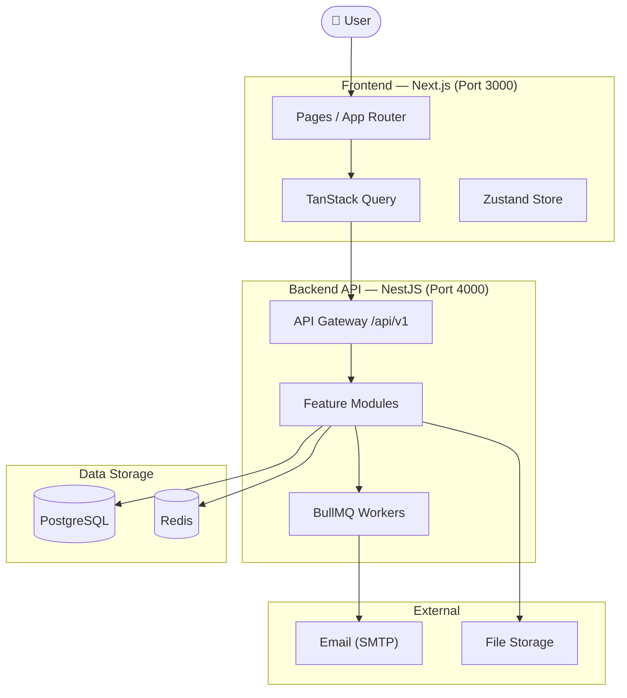

# HelpDesk — SaaS Ticket Management System

A full-stack SaaS HelpDesk application built with NestJS, Next.js, PostgreSQL, Redis, and BullMQ.

## Tech Stack

**Backend:** NestJS · TypeScript · PostgreSQL · Prisma ORM · Redis · BullMQ · JWT · Swagger  
**Frontend:** Next.js 14 · TypeScript · TailwindCSS · TanStack Query · Zustand · Shadcn/UI  
**DevOps:** Docker Compose · GitHub Actions · ESLint · Prettier · Husky

## Quick Start

### Prerequisites
- Docker & Docker Compose
- Node.js 20+

### Development (local)

```bash
# 1. Start infrastructure (PostgreSQL + Redis)
npm run dev:infra

# 2. Setup backend
cd backend
cp .env.example .env
npm install
npx prisma migrate dev
npx prisma db seed
npm run start:dev

# 3. Setup frontend (new terminal)
cd frontend
cp .env.example .env.local
npm install
npm run dev
```

Open:
- Frontend: http://localhost:3000
- Backend API: http://localhost:4000/api/v1
- Swagger Docs: http://localhost:4000/api/v1/docs

Default credentials: `admin@helpdesk.com` / `Admin123!`

### Production (Docker)

```bash
cp backend/.env.example backend/.env
# Edit backend/.env with production values

docker compose up -d
```

## Architecture



## Project Structure

```
helpdesk-saas/
├── backend/                  # NestJS API
│   ├── prisma/               # Schema & migrations
│   └── src/
│       ├── auth/             # Authentication
│       ├── users/            # User management
│       ├── organizations/    # Multi-tenancy
│       ├── tickets/          # Core ticket system
│       ├── comments/         # Comments & mentions
│       ├── attachments/      # File uploads
│       ├── notifications/    # In-app & email
│       ├── audit-log/        # Audit trail
│       ├── dashboard/        # Analytics
│       ├── common/           # Shared utilities
│       └── config/           # Configuration
├── frontend/                 # Next.js App
│   └── src/
│       ├── app/              # App Router pages
│       ├── components/       # UI components
│       ├── stores/           # Zustand stores
│       ├── hooks/            # Custom hooks
│       ├── api/              # API calls
│       └── types/            # TypeScript types
├── .github/workflows/        # CI/CD
├── docker-compose.yml        # Production
└── docker-compose.dev.yml    # Development infra
```

## API Documentation

Available at http://localhost:4000/api/v1/docs (Swagger UI)

## Roles & Permissions

| Role | Permissions |
|---|---|
| SUPER_ADMIN | Full system access |
| ORG_ADMIN | Manage organization, members, all tickets |
| AGENT | Handle assigned tickets, internal comments |
| CUSTOMER | Create & view own tickets |

## CI/CD

GitHub Actions runs on every PR and push to `main`/`develop`:
- Lint (ESLint)
- Type check
- Unit tests (with real PostgreSQL & Redis services)
- Build verification
